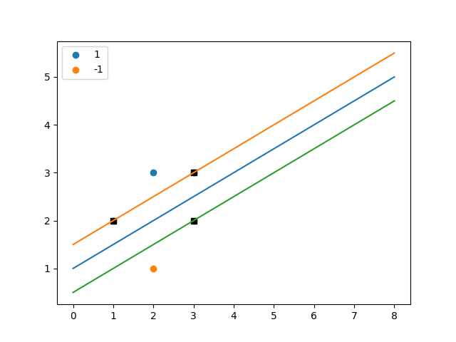

# HW 09

## 1

> 已知正例点$x_1=(1, 2)^T, x_2 = (2, 3)^T, x_3 = (3, 3)^T$，负例点$x_4 = (2,1)^T, x_5 = (3, 2)^T$，试求Hard Margin SVM的最大间隔分离超平面和分类决策函数，并在图上画出分离超平面、间隔边界及支持向量。

最大间隔分离超平面也就是以下问题的条件极值问题：
$$
min_{\boldsymbol w, b}\frac12||\boldsymbol w||^2 \ \ \ subject\ to \ \forall i, y_i(\boldsymbol w^T\boldsymbol x_i+b) \ge 1
$$
将数据点代入约束条件，得到：
$$
\begin{aligned}
&y_1 (\boldsymbol{w}^T \boldsymbol{x}_1 + b) \geq 1 \\
&y_2 (\boldsymbol{w}^T \boldsymbol{x}_2 + b) \geq 1 \\
&y_3 (\boldsymbol{w}^T \boldsymbol{x}_3 + b) \geq 1 \\
&y_4 (\boldsymbol{w}^T \boldsymbol{x}_4 + b) \geq 1 \\
&y_5 (\boldsymbol{w}^T \boldsymbol{x}_5 + b) \geq 1
\end{aligned}
$$
显然这个问题是一个二维问题，因此可以将$\boldsymbol{w}$表示为$\boldsymbol{w} = (w_1, w_2)^T$。再将上面的约束转化为等式约束，令拉格朗日乘子$\alpha_i \geq 0$可以得到：
$$
L=\frac12(w_1^2+w_2^2)+\sum_{i=1}^5\alpha_i(1-y_i(\boldsymbol{w}^T \boldsymbol{x}_i + b))
$$
将上述等式代入原优化问题，得到：
$$
\begin{aligned}
\max_{\boldsymbol{\alpha}} &\quad \sum_{i=1}^n \alpha_i - \frac{1}{2} \sum_{i=1}^n \sum_{j=1}^n \alpha_i \alpha_j y_i y_j \boldsymbol{x}_i^T \boldsymbol{x}_j \\
\text{s.t.} &\quad \sum_{i=1}^n \alpha_i y_i = 0 \\
&\quad \alpha_i \geq 0, \quad i=1, 2, \ldots, n
\end{aligned}
$$
经过求解，得到$w_1=-1, w_2=2, b=-2$，因此最大间隔分离超平面的解析式为：
$$
x^{(1)} -2x^{(2)} +2 = 0
$$
分类决策函数为：
$$
f(\boldsymbol{x}) = \text{sign}(x^{(1)} -2x^{(2)} +2)
$$
支持向量为：
$$
\boldsymbol{x}_1 = (1, 2)^T \\
\boldsymbol{x}_3=(3, 3)^T \\
 \boldsymbol{x}_5=(3, 2)^T
$$
图像如下，其中蓝线为最大间隔分离超平面，两侧直线为间隔边界，黑色正方形点为支持向量

## 2

> 计算$\frac{\partial}{\partial w_j}L_{CE}(w,b)$，其中
>
> $L_{CE}(w,b) = -[ylog\sigma(w\cdot x+b)+(1-y)log(1-\sigma(w\cdot x+b))]$
>
> 为Logistic Regression的Loss Function。
>
> 已知
>
> $\frac{\partial}{\partial z}\sigma(z)=\frac{\partial}{\partial z}\frac1{1+e^{-z}} = -(\frac1{1+e^{-z}})^2 \times(-e^{-z}) = \sigma(z)(1-\sigma(z))$

根据链式法则，可以得到：
$$
\frac{\partial}{\partial w_j}L_{CE}(w,b) = \frac{\partial}{\partial \sigma}L_{CE}(w,b)\cdot \frac{\partial\sigma}{\partial z}\cdot\frac{\partial z}{\partial w_j}
$$
首先计算第一项：
$$
\frac{\partial L_{CE}(w,b)}{\partial \sigma} = -\left(\frac{y}{\sigma(w\cdot x + b)} - \frac{1-y}{1-\sigma(w\cdot x + b)}\right)
$$
然后计算第二项：
$$
\frac{\partial \sigma}{\partial z} = \sigma(z)(1-\sigma(z))
$$
然后计算第三项：
$$
\frac{\partial z}{\partial w_j} = \frac{\partial}{\partial w_j}(w\cdot x + b) = x_j
$$
代入原式可以得到：
$$
\frac{\partial}{\partial w_j}L_{CE}(w,b) = - \left(\frac{y}{\sigma(w\cdot x + b)} - \frac{1-y}{1-\sigma(w\cdot x + b)}\right) \cdot \sigma(w\cdot x + b)(1-\sigma(w\cdot x + b)) \cdot x_j
$$
最后化简一下得到：
$$
\frac{\partial}{\partial w_j}L_{CE}(w,b) = (\sigma(w\cdot x + b) - y) \cdot x_j
$$
这里就得到了Loss Function$w_j$的对偏导